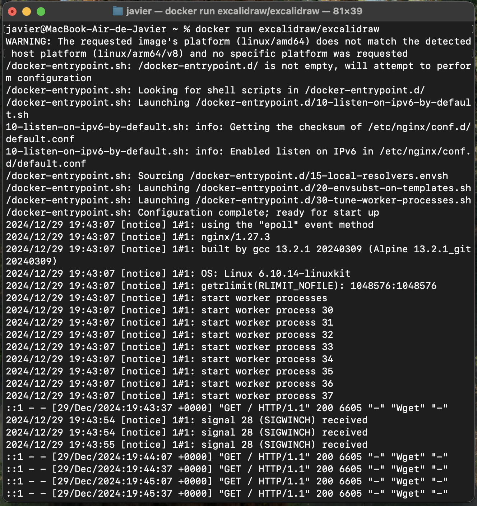
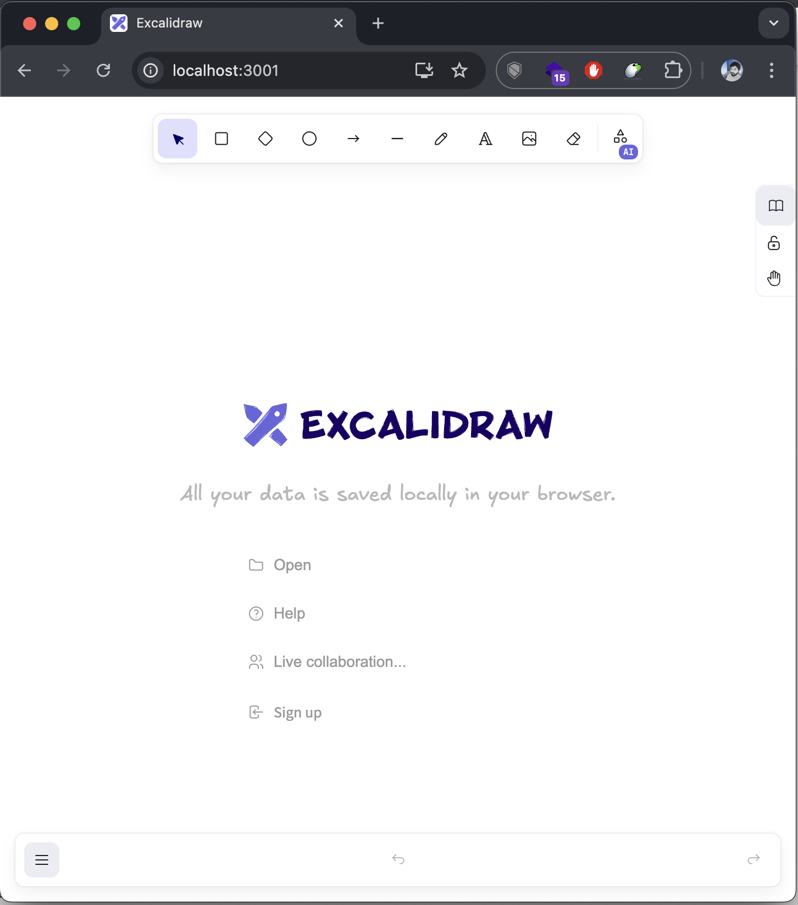
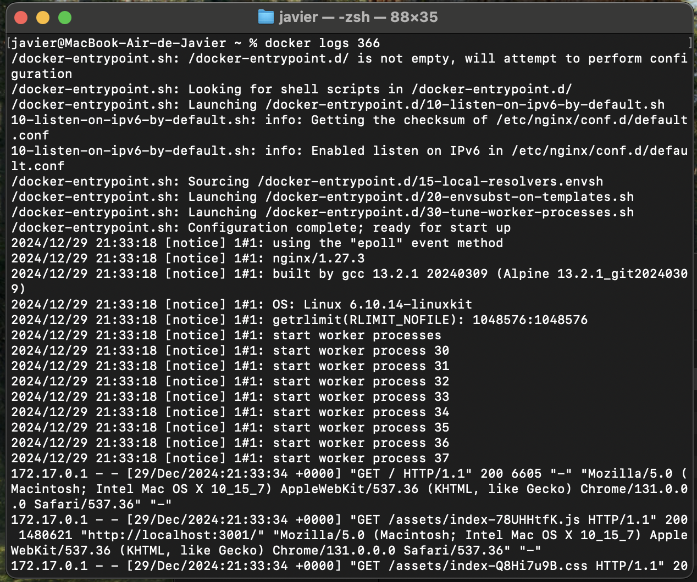

# 6. Contenedor de Excalidraw ✏️

## My first Excalidraw container 

Para comenzar a utilizar **Excalidraw** dentro de un contenedor, utilizamos el comando ```docker run```. Este comando nos permite arrancar un contenedor a partir de una imagen específica. La sintaxis básica es:
```bash
docker run <imagen>
```

En este caso vamos a usar el siguiente comando en la terminal:

```bash
docker run excalidraw/excalidraw
```
La ejecución del del comando te debería dejar la terminal tomada y verías algo como esto



Aunque no tengamos la imagen descargada, Docker buscará automáticamente la imagen en Docker Hub, la descargará y arrancará el contenedor.

Como ya te mencioné, la ejecución del comando run dejó tomada la terminal, ahora no puedes utilizarla. Entonces lo que haremos es abrir otra terminal y vamos a consultar los contenedores que están en ejecución, con el comando ```docker ps```:

```bash
docker ps
```

Y deberías ver el contenedor de excalidraw que está en ejecución


La información que veras sera:

* **CONTAINER ID**:
Es un identificador único generado automáticamente para cada contenedor, útil para realizar acciones específicas sobre él (como detenerlo o eliminarlo).

* **IMAGE**:
Muestra el nombre y la etiqueta (tag) de la imagen que se utilizó para crear el contenedor. 

* **COMMAND**:
El comando que se está ejecutando como proceso principal del contenedor (normalmente definido en la imagen o sobreescrito al iniciar el contenedor). Ejemplo: /bin/bash.

* **CREATED**:
Indica cuánto tiempo ha pasado desde que el contenedor fue creado. Ejemplo: 3 hours ago.

* **STATUS**:
El estado actual del contenedor, que puede ser:

    Up X minutes/hours/days: El contenedor está ejecutándose.
    Exited (code) X minutes ago: El contenedor se detuvo (con un código de salida).

* **PORTS**:
Lista los puertos que están expuestos y mapeados en el contenedor.

* **NAMES**:
El nombre asignado al contenedor, ya sea generado automáticamente o definido por el usuario al crearlo.

Si además queremos ver todos los contenedores, tanto los que están en ejecución como los que han sido detenidos, utilizamos:

```bash
docker ps -a
```

Ahora vamos a detener el contenedor que se está ejecutando, para eso en la terminal colocamos el siguiente comando 
```bash
docker stop <CONTAINER ID>
```
En este caso el ID del contenedor en ejecución es 948ecd7e85a6, por lo que el comando es ```docker stop 948ecd7e85a6``` o también, como se muestra en la imagen que está a continuación, podemos utilizar solo los primeros 3 caracteres del ID.


Como puedes ver, cuando ejecutamos el comando ```docker ps``` ya no hay contenedores ejecutándose.

### Opciones comunes con docker run

El comando ```docker run``` nos permite personalizar el comportamiento de los contenedores mediante diferentes opciones. Algunas de las más comunes son:

* ```-d```: Ejecuta el contenedor en segundo plano.
* ```-p```: Mapea un puerto del host a un puerto del contenedor.
* ```--name```: Asigna un nombre personalizado al contenedor.
* ```--rm```: Elimina automáticamente el contenedor una vez detenido.
* ```-v```: Mapea un volumen entre el host y el contenedor.
* ```-e```: Define variables de entorno.


### Ejemplo práctico con Excalidraw
Si queremos ejecutar Excalidraw en segundo plano y mapear un puerto para acceder a él desde el navegador, podemos hacerlo con:
```bash
docker run -d -p 3001:80 --name excalidraw-container excalidraw/excalidraw
```

* ```-d```: Ejecuta el contenedor en segundo plano.
* ```-p 3001:80```: Mapea el puerto 80 del contenedor al puerto 3001 del host, permitiendo acceder a la aplicación en http://localhost:3001.
* ```--name excalidraw-container```: Asigna el nombre "excalidraw-container" al contenedor.

Con este comando, tendremos Excalidraw ejecutándose en un contenedor y accesible desde el navegador. 



Con un ```docker ps```podemos ver que el contenedor se está ejecutando y está mapeando el puerto 3001 de nuestra máquina al 80 del contenedor.


### Ver logs del contenedor

Como el contenedor está en ejecución en segundo plano, podemos consultar sus logs para ver información sobre lo que está ocurriendo dentro del contenedor:

```bash
docker logs excalidraw-container
```

O también 

```bash
docker logs <CONTAINER ID>
```


Si queremos seguir los logs en tiempo real:
```bash
docker logs -f excalidraw-container
```

Para desacoplarnos sin detener el contenedor, usamos la combinación de teclas Control + P + Q.

### Política de reinicio

Si deseamos que el contenedor de Excalidraw se reinicie automáticamente en caso de fallo, podemos usar la opción ```--restart```. Por ejemplo, para reiniciarlo siempre que sea necesario:

```bash
docker run --restart always -d -p 3001:80 excalidraw/excalidraw
```