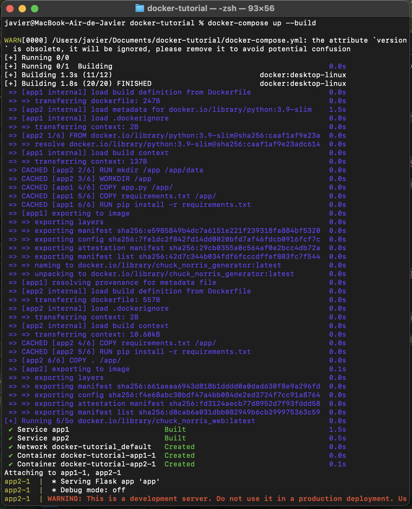

# 8. Docker Compose 🐙

### **¿Qué es docker compose y para qué sirve?**

Docker Compose es una herramienta que nos permite definir y manejar múltiples contenedores Docker como una única aplicación. En lugar de correr cada contenedor manualmente con comandos largos, puedes configurar todos tus servicios (contenedores) en un solo archivo YAML (`docker-compose.yml`) y ejecutarlos juntos con un solo comando.

---

### **Beneficios de Usar Docker Compose**

1. **Simplicidad y organización:**
   - Todos los servicios están definidos en un único archivo.
   - Fácil de leer y entender, especialmente en proyectos con varios contenedores.

2. **Automatización:**
   - Puedes iniciar, detener y reiniciar todos los servicios con un solo comando.
   - Define relaciones entre los servicios, como cuál debe iniciarse primero.

3. **Consistencia:**
   - Todos los miembros del equipo utilizan la misma configuración.
   - No necesitas recordar largos comandos `docker run`.

4. **Compartir recursos:**
   - Los contenedores pueden compartir volúmenes y redes, facilitando la comunicación y el intercambio de datos.

---

### **¿Por qué usar docker compose con nuestras apps?**

En nuestro caso, tenemos dos aplicaciones, `app1` y `app2`, que trabajan juntas:

1. **`app1`:**
   - Genera bromas de Chuck Norris usando una API y las guarda en un archivo `jokes.txt`.
   - Este archivo se guarda en un volumen compartido (`data`).

2. **`app2`:**
   - Lee las bromas de `jokes.txt` y las combina con imágenes de personajes de Rick and Morty.
   - Muestra todo esto en un sitio web estilo Bootstrap.

Docker Compose simplifica la forma en que estas dos aplicaciones trabajan juntas. Veamos por qué:

---

### Creando el docker-compose

En el mismo directorio docker-tutorial que utilizamos la lección anterior, debes crear el archivo llamada `docker-compose.yml`
Asegurate que quede en el mismo nivel que están `app1`, `app2`, y `data`

```bash
docker-tutorial/
├── app1/               
│   ├── app.py
│   ├── requirements.txt
│   ├── Dockerfile
|── data/
├── app2/               
│   ├── app.py
│   ├── requirements.txt
│   ├── Dockerfile
│   ├── static/
│       ├── style.css
├── docker-compose.yml
```

### Configurando el docker-compose

Abre con el editor el archivo `docker-compose.yml`, copia la configuración que está a continuación y pegala en el archivo:

```yml
services:
  app1:
    image: chuck_norris_generator
    build:
      context: ./app1
    environment:
      - API_URL=https://api.chucknorris.io/jokes/random
    volumes:
      - ./data:/app/data  # Monta la carpeta 'data' del host en '/app/data' en el contenedor
    restart: always

  app2:
    image: chuck_norris_web
    build:
      context: ./app2
    environment:
      - API_URL=https://rickandmortyapi.com/api/character
    ports:
      - "8081:5000"
    volumes:
      - ./data:/app/data  # Monta la carpeta 'data' del host en '/app/data' en el contenedor
    depends_on:
      - app1  # Asegura que 'app1' se inicie antes de 'app2'
    restart: always
```

### Corramos junto a docker-compose

Abre una terminal y dirigete a docker-tutorial, y ejecuta el comando `docker-compose up --build`

```bash
cd docker-turorial
docker-compose up --build
```

Si toda va bien deberías ver como se están iniciando los contenedores con las dos apps.



Si abres docker desktop deberías tener un contenedor llamado `docker-tutorial`y si le das click deberías ver la orquestación de los dos contenedores


Ahora si ingresas al localhost:8081 en tu navegador deberías ver la app funcionando.


### **Beneficios específicos para este proyecto**

1. **Orquestación de `app1` y `app2`:**
   - Con `depends_on`, nos aseguramos de que `app1` (el generador de bromas) se inicie antes que `app2` (el visualizador de bromas e imágenes).
   - Esto evita errores de sincronización.

2. **Volumen compartido (`data`):**
   - Ambos contenedores comparten el volumen `data` para leer y escribir las bromas.
   - Con docker compose, este volumen se configura fácilmente en el archivo YAML.

3. **Gestión de Variables de Entorno:**
   - Cada app recibe la URL de su respectiva API (`Chuck Norris` para `app1` y `Rick and Morty` para `app2`) a través de variables de entorno.

4. **Facilidad para probar y reiniciar:**
   - Si algo falla, puedes detener y reiniciar todo con:
     ```bash
     docker-compose down
     docker-compose up
     ```

5. **Compatibilidad de puertos:**
   - `app2` expone su contenido en el puerto 8081 para acceder al sitio web.

---

### **Resumiendo...**

Usar Docker Compose con **`app1`** y **`app2`** nos permite:

1. Ejecutar ambas aplicaciones juntas con un solo comando.
2. Compartir datos entre los contenedores de manera eficiente.
3. Asegurar que `app2` no intente funcionar hasta que `app1` haya comenzado a generar datos.
4. Hacer nuestro entorno más fácil de manejar y reproducir.

Docker compose no solo simplifica el trabajo, sino que también muestra el poder de la orquestación y la modularidad en proyectos Docker. 🚀