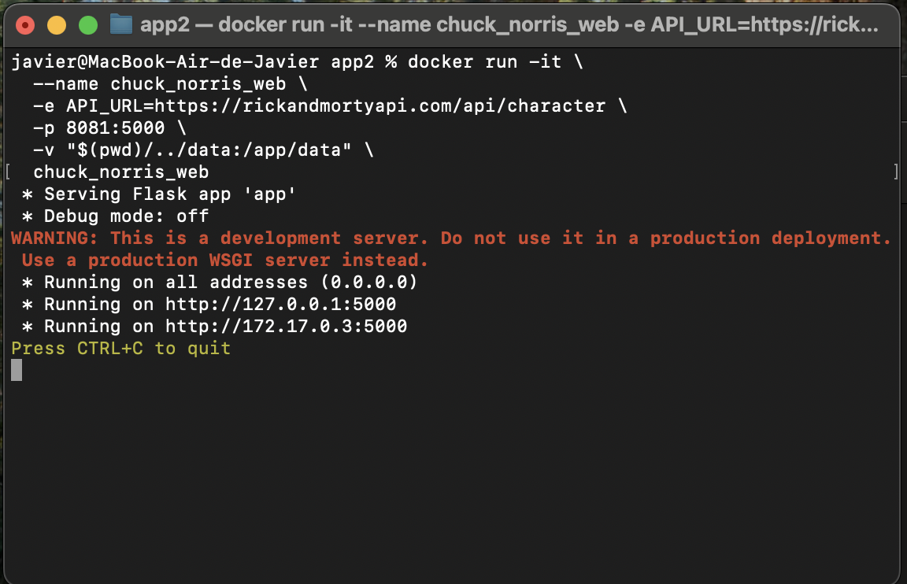
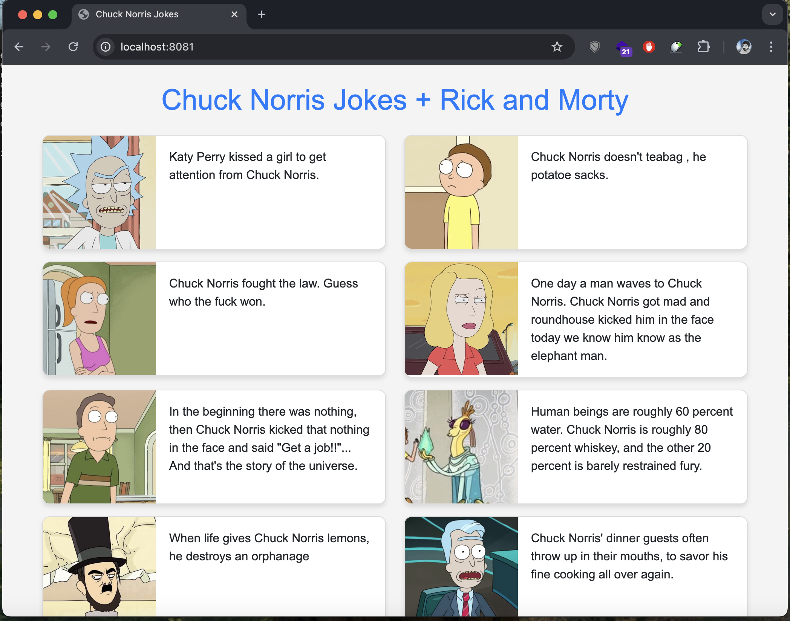
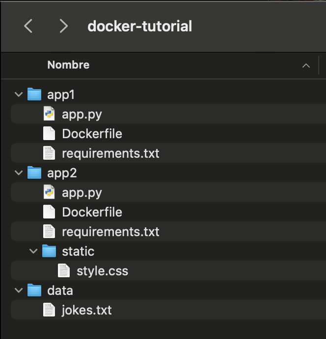

# 7. Variables de Entorno y Volúmenes 

## **Crear nuestra primera App contenerizada**

Llego el momento de crear nuestra primera app que corra en un contenedor.

## **docker-tutorial** 🗂️

1. Crea la carpeta **docker-tutorial**
2. Ingresa a **docker-tutorial** y crea en una carpeta que se llame **app1** y otra llamada **data**
3. Abrela **docker-tutorial** en tu editor de código, yo lo hago en VS Code
4. Una vez en el editor, dentro de **app1** crea el archivo ```app.py```
5. Crea dentro de app1 un archivo txt llamado ```requirements```
6. Crea dentro de app1 una carpeta archivo llamado ```Dockerfile```

Tu carpeta docker-tutorial se debe ver así

```bash
docker-tutorial/
├── app1/               
│   ├── app.py
│   ├── requirements.txt
│   ├── Dockerfile
|── data/
```
---

## **app1**
**Desarrollemos app1**

### **app.py**
Sigamos, ahora abre en el ```app.py``` y copia el código que está a continuación

```python
import os
import requests
import time

# Leer la URL de la API desde la variable de entorno
api_url = os.getenv('API_URL')

# Ruta al archivo para guardar las bromas
data_dir = '/app/data'
data_file = os.path.join(data_dir, 'jokes.txt')

# Crear el directorio si no existe
if not os.path.exists(data_dir):
    os.makedirs(data_dir)

# Verificar si el archivo existe, si no, lo creamos automáticamente
if not os.path.exists(data_file):
    open(data_file, 'w').close()  # Esto crea el archivo vacío si no existe

# Función para hacer la solicitud y guardar la broma
def fetch_and_save_joke():
    response = requests.get(api_url)
    if response.status_code == 200:
        joke = response.json().get('value', 'No joke found.')
        print(f"Broma obtenida: {joke}")

        # Guardar la broma en el archivo (modo append)
        with open(data_file, 'a') as file:
            file.write(joke + '\n')
        print(f"Broma guardada en {data_file}")
    else:
        print(f"Error al obtener la broma: {response.status_code}")

# Ejecutar la solicitud cada 1 minuto
print("Iniciando solicitudes a la API...")
while True:
    fetch_and_save_joke()
    print("Esperando 1 minuto para la próxima solicitud...")
    time.sleep(60)
```

El código anterior es sencillo, realiza una **petición a la API de don Chuck Norris** cada un minuto y **guarda** una de sus memorables **frases** en un **archivo txt** que queda en la **carpeta data**. 

---
### **requirements.txt**

Abre el archivo requirements y dentro copia y pega lo siguiente:

```bash
requests
```
¡No olvides guardar!

El requirements.txt contiene las dependencias que se utilizarán, en este caso requests para hacer las peticiones a la API de don Chuck.

---

### **Dockerfile**

Ahora abre el archivo ```Dockerfile```` y pega lo que está aquí abajo:

```Dockerfile
# Usa la imagen base oficial de Python 3.9 en su versión ligera (slim) para minimizar el tamaño de la imagen
FROM python:3.9-slim

# Crea los directorios necesarios dentro del contenedor: 
# - /app para almacenar el código de la aplicación
# - /app/data para guardar los datos generados por la aplicación (en este caso, bromas)
RUN mkdir /app /app/data

# Establece el directorio de trabajo dentro del contenedor como /app
# Todas las operaciones posteriores se realizarán desde este directorio
WORKDIR /app

# Copia el archivo principal del script (app.py) al directorio /app dentro del contenedor
COPY app.py /app/

# Copia el archivo de dependencias (requirements.txt) al directorio /app dentro del contenedor
COPY requirements.txt /app/

# Instala las dependencias de Python definidas en requirements.txt
RUN pip install -r requirements.txt

# Define el comando predeterminado que se ejecutará cuando el contenedor arranque
CMD ["python", "app.py"]
```

Lee con atención el ```Dockerfile``` para entender que se hace en cada paso:

1. ```FROM python:3.9-slim```: 
Especifica la imagen base. En este caso, usa una imagen ligera de Python 3.9 para reducir el tamaño del contenedor.

2. ```RUN mkdir /app /app/data```:
Crea los directorios necesarios:
/app: Contendrá los archivos de la aplicación.
/app/data: Usado para almacenar datos generados por la aplicación.

3. ```WORKDIR /app```:
Cambia el directorio de trabajo dentro del contenedor a /app. Cualquier comando posterior asumirá que está en este directorio.

4. ```COPY app.py /app/```:
Copia el archivo app.py desde tu máquina al contenedor, ubicándolo en el directorio /app.

5. ```COPY requirements.txt /app/```:
Copia el archivo requirements.txt (que lista las dependencias de Python) desde tu máquina al contenedor.

6. ```RUN pip install -r requirements.txt```:
Instala las bibliotecas de Python especificadas en requirements.txt. Esto asegura que todas las dependencias necesarias estén disponibles en el contenedor.

7. ```CMD ["python", "app.py"]```:
Define el comando predeterminado para ejecutar cuando el contenedor se inicie. En este caso, ejecuta app.py usando Python.

---
### **Vamoh a probarlo**

Primero recuerda tener Docker Desktop en ejecución.

Ahora abre una terminal y navega hasta la carpeta donde está el ```Dockerfile``` que sería algo así:

```bash
cd docker-tutorial
cd app1
```

Ahora construiremos la imagen, en el mismo terminal ejecuta este comando:

```bash
docker build -t chuck_norris_generator -f Dockerfile .
```

Si todo va bien deberías ver el proceso de creación de la imagen de la app1


Ahora haremos correr a ese container! Copia y pega las siguientes instrucciones en tu terminal:

**Para macOS**:
```bash
docker run -it \
  --name chuck_norris_generator \
  -e API_URL=https://api.chucknorris.io/jokes/random \
  -v "$(pwd)/../data:/app/data" \
  chuck_norris_generator
````

**Para Windows (PowerShell)**
```bash
docker run -it `
  --name chuck_norris_generator `
  -e API_URL=https://api.chucknorris.io/jokes/random `
  -v ${PWD}/../data:/app/data `
  chuck_norris_generator
```

Si todo va bien, deberías ver los logs de tu contenedor en la terminal y al abrir el jokes.txt debería estar el primer chiste de don Chuck.


---
### **Qué hicimos con este comando**

¡Vamos a desmenuzar este comando para entenderlo paso a paso! Aquí estamos ejecutando un contenedor de Docker que genera bromas de don Chuck Norris, le asignamos un nombre, le pasamos una variable de entorno para configurar la API y conectamos un volumen para guardar las bromas.

---

### **Explicación del comando**

```powershell
docker run -it `
  --name chuck_norris_generator `
  -e API_URL=https://api.chucknorris.io/jokes/random `
  -v ${PWD}/../data:/app/data `
  chuck_norris_generator
```

#### **1. `docker run`**
Esto le dice a Docker que queremos ejecutar un contenedor basado en una imagen (en este caso, `app1`).

#### **2. `-it`**
Esto significa que el contenedor se ejecutará de manera interactiva y mostrará la salida directamente en nuestra terminal. Básicamente, estamos "entrando" al contenedor.

#### **3. `--name chuck_norris_generator`**
Aquí le damos un nombre al contenedor: **`chuck_norris_generator`**. Esto es útil porque en lugar de lidiar con un CONTAINER ID largo generado por Docker, ahora podemos referirnos a este contenedor por su nombre. Por ejemplo, si queremos detenerlo, podemos usar:
```bash
docker stop chuck_norris_generator
```

#### **4. `-e API_URL=https://api.chucknorris.io/jokes/random`**
**¡Esta es la clave para personalizar el contenedor!**  
Con `-e`, le pasamos una **variable de entorno** llamada `API_URL`. Esto le dice al contenedor qué API debe usar para obtener las bromas. En este caso, apuntamos a la API de Chuck Norris.

**¿Por qué usar una variable de entorno?**
- Porque hace que el código sea más flexible. Si alguna vez necesitas cambiar la URL de la API, no tendrás que modificar el código del contenedor. Solo cambias la variable de entorno al ejecutarlo.

#### **5. `-v ${PWD}/../data:/app/data`**
**Aquí está el truco para guardar datos entre ejecuciones.**  
Con `-v`, estamos creando un **volumen**. En términos simples, esto conecta un directorio de tu máquina (`${PWD}/../data`) con un directorio dentro del contenedor (`/app/data`).

¿Qué significa esto?  
1. **`${PWD}/../data`:**  
   - Este es el directorio en tu máquina donde se guardarán las bromas.  
   - `${PWD}` obtiene el directorio actual (en este caso, donde estás ejecutando el comando), y `../data` sube un nivel para buscar la carpeta `data`.

2. **`/app/data`:**  
   - Es el directorio dentro del contenedor donde se escriben las bromas.

3. **Resultado:**  
   Las bromas generadas por el contenedor se guardan en tu máquina local en `../data/jokes.txt`. Esto significa que si detienes o eliminas el contenedor, ¡las bromas seguirán ahí! 😂

#### **6. `app1`**
Por último, este es el nombre de la imagen Docker que queremos ejecutar.

---

### **Qué logramos**
- **Usamos una variable de entorno (`API_URL`)** para configurar la API desde donde se obtienen las bromas, sin modificar el código del contenedor.
- **Montamos un volumen (`-v`)** para que los datos generados por el contenedor (las bromas) se guarden en nuestra máquina. Esto asegura que las bromas persistan incluso si el contenedor se detiene o elimina.

---

### **¿Por qué Importa?**
1. **Flexibilidad con `-e`:**  
   Las variables de entorno hacen que el contenedor sea reutilizable en diferentes escenarios. Por ejemplo, puedes usar otra API solo cambiando la URL que pasas a `API_URL`.

2. **Persistencia con `-v`:**  
   Los volúmenes permiten que los datos sobrevivan al ciclo de vida del contenedor. Esto es fundamental para aplicaciones que generan o consumen datos.

Ahora vamos con la segunda app

---
## **app2**

Sigue los pasos que están a continuación

1. En la **docker-tutorial** crea un directorio que se llame **app2**, abre esta carpeta en tu editor
2. En **app2** crea la carpeta **static**, luego ingresa a ella y crea el archivo ```style.css```
3. Ahora te devuelves un nivel y en **app2** crea el archivo ```app.py```
4. Crea dentro de app2 un archivo txt llamado ```requirements```
5. Crea dentro de app2 una carpeta archivo llamado ```Dockerfile```

Tu carpeta docker-tutorial se debe ver así

```bash
docker-tutorial/
├── app1/               
│   ├── app.py
│   ├── requirements.txt
│   ├── Dockerfile
|── data/
├── app2/               
│   ├── app.py
│   ├── requirements.txt
│   ├── Dockerfile
│   ├── static/
│       ├── style.css
```
---
### **app.py**
Sigamos, ahora abre en el ```app.py``` y copia el código que está a continuación

```python
from flask import Flask, render_template_string
import os
import requests

app = Flask(__name__)

# Rutas al archivo de bromas
data_file = '/app/data/jokes.txt'

# URL de la API de Rick and Morty

rick_and_morty_api = os.getenv('API_URL')

@app.route('/')
def show_jokes_and_images():
    # Leer las bromas desde el archivo
    if os.path.exists(data_file):
        with open(data_file, 'r') as file:
            jokes = file.read().splitlines()
    else:
        jokes = ["No hay bromas disponibles aún."]

    # Obtener un personaje aleatorio de Rick and Morty
    response = requests.get(rick_and_morty_api)
    if response.status_code == 200:
        characters = response.json()['results']
        images = [char['image'] for char in characters]
    else:
        images = ["/static/default.jpg"]  # Imagen por defecto si falla la API

    # Combinar bromas con imágenes aleatorias
    cards = [{"joke": joke, "image": images[i % len(images)]} for i, joke in enumerate(jokes)]

    # Renderizar HTML
    html = """
    <!DOCTYPE html>
    <html>
    <head>
        <title>Chuck Norris Jokes</title>
        <link rel="stylesheet" href="https://cdn.jsdelivr.net/npm/bootstrap@5.3.0-alpha1/dist/css/bootstrap.min.css">
        <link rel="stylesheet" href="/static/style.css">
        <script>
            setInterval(function() {
                location.reload();
            }, 60000); // Recargar cada 60 segundos
        </script>
    </head>
    <body>
        <div class="container mt-4">
            <h1 class="text-center mb-4">Chuck Norris Jokes + Rick and Morty</h1>
            <div class="row">
                
                <div class="col-md-6 mb-3">
                    <div class="card">
                        <div class="row g-0">
                            <div class="col-md-4">
                                
                            </div>
                            <div class="col-md-8">
                                <div class="card-body">
                                    <p class="card-text">{{ card.joke }}</p>
                                </div>
                            </div>
                        </div>
                    </div>
                </div>
                
            </div>
        </div>
    </body>
    </html>
    """
    return render_template_string(html, cards=cards)

if __name__ == '__main__':
    app.run(host='0.0.0.0', port=5000)

```

Este código crea una aplicación web con Flask que combina bromas de Chuck Norris con imágenes de personajes de **Rick and Morty**. 

1. **Lee las bromas** de un archivo (`jokes.txt`), si no existe, muestra un mensaje por defecto.
2. **Obtiene personajes** de Rick and Morty desde una API y extrae sus imágenes. Si la API falla, usa una imagen por defecto.
3. **Combina bromas e imágenes** en tarjetas (`cards`) usando un diseño horizontal estilo Bootstrap.
4. **Renderiza un HTML dinámico** que muestra las tarjetas, actualizando la página automáticamente cada 60 segundos para reflejar cambios en las bromas.

- En /static/ agrega cualquier imagen que tengas con el nombre default.jpg, de esta forma si falla la API de Rick and Morty se verá una imagen en las tarjetas.
---

### **requirements.txt**

Abre el archivo requirements y dentro copia y pega lo siguiente:

```bash
flask
requests
```
¡No olvides guardar!

El requirements.txt contiene las dependencias que se utilizarán, en este caso requests para crear la aplicación web y requests para las peticiones al API de Ricky and Morty

---
### **style.css**

Ingresa a la carpeta **static** y abre el archivo `style.css` y pega ahí las lineas de código que están a continuación:

```css
body {
    font-family: Arial, sans-serif;
    background-color: #f4f4f4;
    margin: 0;
    padding: 0;
}

h1 {
    color: #007bff;
}

.card {
    border: 1px solid #ddd;
    box-shadow: 0 4px 6px rgba(0, 0, 0, 0.1);
    border-radius: 10px;
    overflow: hidden;
}

.card img {
    max-height: 150px;
    object-fit: cover;
}

.card-text {
    font-size: 1rem;
    line-height: 1.5;
}

```
---
### **Dockerfile**

Ahora abre el archivo `Dockerfile` y pega lo que está aquí abajo:

```Dockerfile
# Usa una imagen base ligera de Python 3.9
FROM python:3.9-slim

# Crea los directorios necesarios dentro del contenedor: 
# - /app para almacenar el código de la aplicación
# - /app/data para guardar los datos generados por la aplicación (en este caso, bromas)

RUN mkdir /app /app/data
# Establece el directorio de trabajo dentro del contenedor
WORKDIR /app

# Copia el archivo de requisitos
COPY requirements.txt /app/

# Instala las dependencias
RUN pip install -r requirements.txt

# Copia el código de la aplicación al contenedor
COPY . /app/

# Expone el puerto 5000 para Flask
EXPOSE 5000

# Comando predeterminado para ejecutar la aplicación
CMD ["python", "app.py"]
```
---
### **Vamoh a probarlo**

Primero recuerda tener Docker Desktop en ejecución.

Ahora abre una terminal y navega hasta la carpeta donde está el ```Dockerfile``` que sería algo así:

```bash
cd docker-tutorial
cd app2
```

Ahora construiremos la imagen, en el mismo terminal ejecuta este comando:

```bash
docker build -t chuck_norris_web -f Dockerfile .
```
Deberias ver algo como lo que está en la imagen


Ahora haremos correr a ese container! Copia y pega las siguientes instrucciones en tu terminal:

**Para macOS**:
```bash
docker run -it \
  --name chuck_norris_web \
  -e API_URL=https://rickandmortyapi.com/api/character \
  -p 8081:5000 \
  -v "$(pwd)/../data:/app/data" \
  chuck_norris_web
````

**Para Windows (PowerShell)**:
```bash
docker run -it `
  --name chuck_norris_web `
  - e API_URL=https://rickandmortyapi.com/api/character `
  -p 8081:5000 `
  -v ${PWD}/../data:/app/data `
  chuck_norris_web
```

Si todo va bien, deberías ver algo como esto en la terminal:



Y en el navegador ingresa al localhost:8081 y deberías ver algo como esto:



Y listo, la **app2** esta funcionando 🎉🎉 ahora tienes dos aplicaciones contenerizadas que comparten un volumen y utilizan variables de entorno, en este caso consultan a dos APIS distintas. ¿Vez el potencial de los contenedores? No tuviste que instalar ninguna dependencia de python, no tuviste que descargar python, este código nunca lo ejecutaste en tu VS Code, solo se ejecuto en un ambiente aislado con sus propias dependencias, osea en un contenedor.
La app1 se trae las frases y la app2 las muestra junto con una imagen en el navegador.

Te dejo como debería estar tu estructura de carpetas


