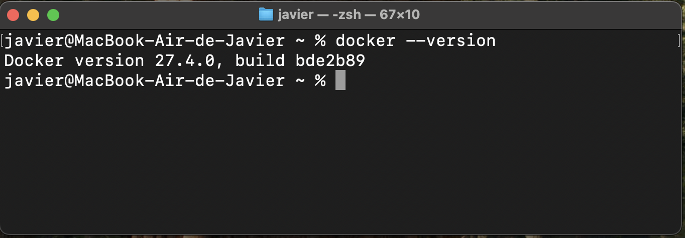

# 3. Instalación de Docker 🐳

## Instalación de Docker Desktop: Paso a Paso

A continuación, se explicará cómo instalar Docker Desktop para comenzar a experimentar con esta tecnología.

### Paso 1: Verificar los requisitos del sistema
Antes de descargar nada, es importante asegurarse de que el equipo cumpla con los requisitos:

* Windows: Es necesario contar con Windows 10/11 de 64 bits con soporte para WSL 2 (Windows Subsystem for Linux 2). Este subsistema es esencial para el correcto funcionamiento de Docker.
* macOS: Se requiere macOS 11.0 (Big Sur) o superior. Docker Desktop es compatible tanto con procesadores Intel como con Apple Silicon (M1/M2).
* Linux: Aunque Docker Desktop está disponible para Linux, generalmente se recomienda instalar directamente Docker Engine en este sistema.

Si el equipo cumple con estos requisitos, se puede proceder al siguiente paso.

### Paso 2: Descargar Docker Desktop
Es necesario visitar el sitio web oficial de Docker:
 👉 https://www.docker.com
 Una vez allí, se debe seleccionar el sistema operativo correspondiente y descargar el instalador. El archivo es liviano, por lo que no debería tardar mucho en descargarse.

### Paso 3: Instalar Docker Desktop
La instalación varía según el sistema operativo. A continuación, se describen los pasos para cada uno:

**En Windows**:
1. Ejecutar el archivo descargado (.exe). Si no se tiene configurado WSL 2, el instalador guiará en el proceso para habilitarlo.
2. Seguir las instrucciones proporcionadas por el asistente. Es importante marcar la opción de integración con Kubernetes si se planea usarlo en el futuro.
3. Reiniciar el equipo si el instalador lo solicita.

**En macOS**:
1. Abrir el archivo .dmg descargado.
2. Arrastrar el icono de Docker a la carpeta de Aplicaciones.
3. Iniciar Docker Desktop desde la carpeta de Aplicaciones. Se solicitarán permisos para realizar configuraciones en el sistema.

**En Linux**:
Seguir las instrucciones específicas para la distribución utilizada, disponibles en la [documentación oficial de Docker](https://docs.docker.com/desktop/setup/install/linux/).

### Paso 4: Verificar la instalación
Es momento de comprobar que todo está funcionando correctamente.
Ahora debes abrir la terminal o consola de comandos y ejecutar el siguiente comando:
```bash
docker --version
```

Esto debería mostrar la versión instalada de Docker. Si aparece el número de versión, significa que la instalación fue exitosa. 🚀

