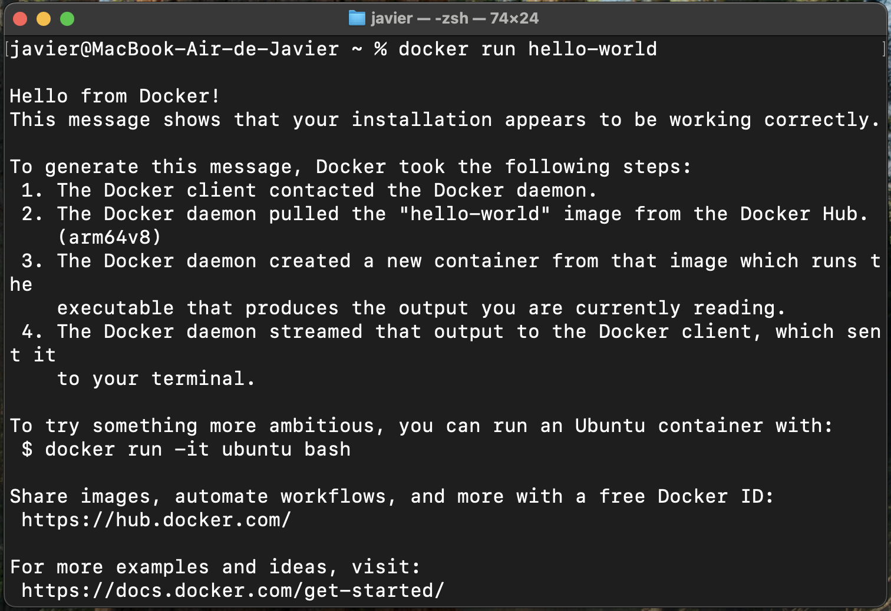

# 4. Mi primer Containerrr 🎤 

## Recuerdo cuando del container yo me enamoré 🎶

Es importantisimo que tengas en ejecución Docker Desktop, asi que asegurate que le diste doble click y está funcionando.

**Hello World desde Docker 🐳**

Ahora abre la terminal y escribe el siguiente comando

```bash
docker run hello-world
```
Si todo está bien deberias ver el **Hello from Docker** en tu terminal.



**¡Felicidades echaste a andar tu primer contenedor!** gracias por revisar este tutorial y nos vemos en el siguiente! 👋

Estaba bromeando, ya ejecutaste tu primer contenedor, ahora vamos a ver los conceptos básicos para que ejecutemos más contenedores.


